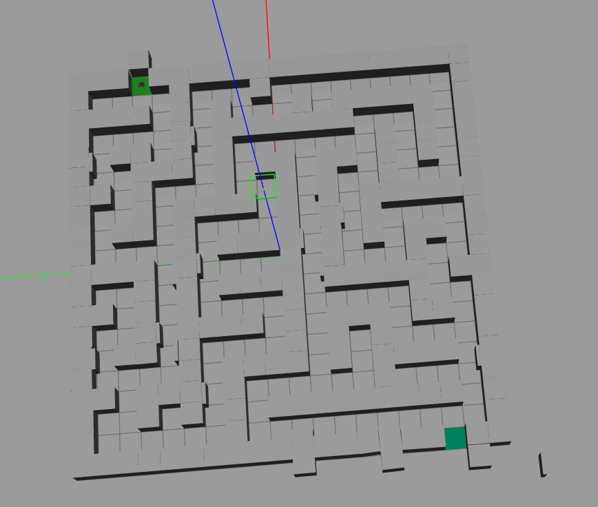
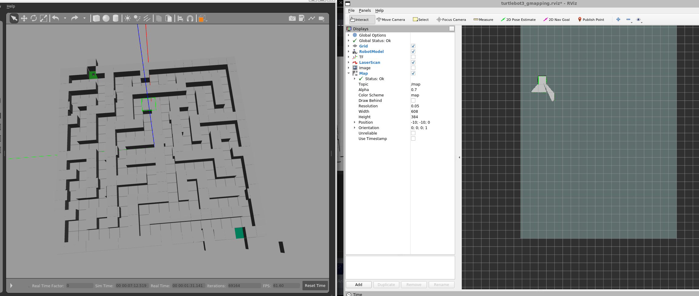

# Robotics Maze Solver Project

This project involves a robot that solves a maze by following the left wall using ROS (Robot Operating System) and is designed for the TurtleBot3 Waffle model. Below are the steps to set up and run the project.

## Prerequisites

Make sure you have the following installed:
- ROS (Robot Operating System)
- TurtleBot3 simulation environment
- Catkin workspace set up for ROS development

## Setup Instructions

1. **Navigate to your catkin workspace**:
   ```bash
   cd ~/catkin_ws/
   ```

2. **Build the workspace**:
   ```bash
   catkin build
   ```

3. **Source the workspace setup file**:
   ```bash
   source ~/catkin_ws/devel/setup.bash
   ```

4. **Set the TurtleBot3 model to Waffle**:
   ```bash
   export TURTLEBOT3_MODEL=waffle
   ```

## Running the Project

### Step 1: Start the Maze Simulation

- **Open Terminal 1** and launch the maze simulation:
   ```bash
   roslaunch maze_simulations maze.launch
   ```
   This will run the maze in its normal condition, without any obstacles.


### Step 2: Run the Maze Solver

- **Open Terminal 2** and run the maze solver script:
   ```bash
   rosrun maze_solver main.py
   ```
   This will start the robot to solve the maze by following the left wall. Once the robot has solved the maze or gained a good understanding of the map, the map will be saved.

### Step 3: End Both Processes

Once the robot has successfully solved the maze and saved the map, you can terminate both processes by pressing `Ctrl + C` in both terminals.

### Step 4: Run the Maze with Obstacles

- **Open Terminal 1** and launch the updated maze with the robot's understanding of the world:
   ```bash
   roslaunch maze_simulations maze_solver.launch
   ```
   This will load the maze with obstacles, but the robot is unaware of them yet.

### Step 5: Set a Goal for the Robot

To tell the robot where to go in the maze, you can publish a goal to the `/move_base_simple/goal` topic.

- **Open Terminal 2** and run the following command to set the goal:
   ```bash
   rostopic pub /move_base_simple/goal geometry_msgs/PoseStamped "header:
     seq: 0
     stamp:
       secs: 0
       nsecs: 0
     frame_id: 'map'
   pose:
     position:
       x: -9.5
       y: -7.5
       z: 0.0
     orientation:
       x: 0.0
       y: 0.0
       z: 0.0
       w: 1.0"
   ```

This will instruct the robot to navigate to the specified coordinates in the maze while avoiding obstacles.

---
[Watch the video](https://youtu.be/QHC2gP0d35Q)